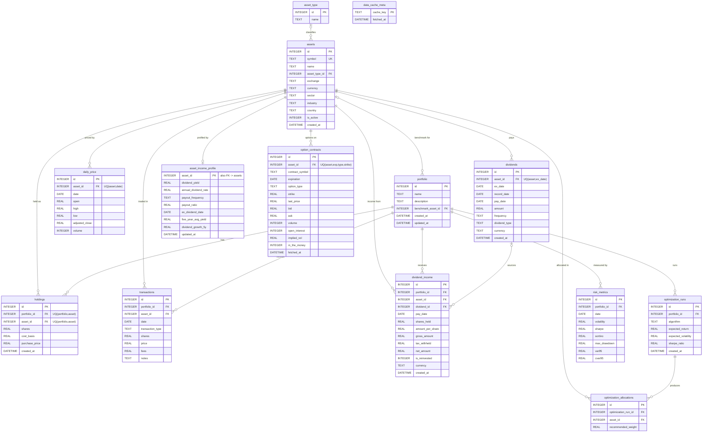

# goqu — System Design

> A living architecture reference for goqu. Update it when a structural decision
> changes, not for every feature. Companion to [ROADMAP.md](ROADMAP.md) (what
> we're building and when) and [design_journal.md](design_journal.md) (raw
> thinking).

Last reviewed: 2026-07-14.

---

## 1. Purpose & Scope

goqu is a **local-first desktop application** for managing a personal
stock/ETF/dividend portfolio: a trading journal, portfolio optimizer, and
strategy-research workbench for the individual quant. It runs entirely on the
user's machine, stores everything in a local SQLite database, and pulls market
data from pluggable providers.

Design goals, in priority order:

1. **The accumulated data is the asset.** Recorded transactions, downloaded
   prices, and research must survive schema churn and app rewrites.
2. **Correctness over cleverness** in anything touching money (cost basis,
   returns, risk).
3. **The quant engine is independent of the GUI.** Calculations live in plain
   Python modules that can be tested and reused headless.
4. **Minimize paid API calls.** Cache aggressively; never fetch what we already
   have and still trust.
5. **Responsive to change.** When data updates, open views reflect it without
   manual refresh — the groundwork for real-time data later.

---

## 2. Product Vision — the four data domains

From [design_journal.md](design_journal.md), the domain model is organized into
four areas. Everything we build maps into one of them:

| Domain | Owns | Status |
| --- | --- | --- |
| **Market Data** | Assets, prices, dividends, corporate actions, options, metadata | Prices/dividends/options/splits/metadata live (validated + gap-backfilled); merger & spinoff entry manual |
| **Portfolio Data** | Portfolios, transactions, holdings, cash | Transactions→holdings + cash tracking live; accounts pending |
| **Analytics** | Optimization runs & allocations, risk metrics | Schema + display live; compute engine pending |
| **Reference Data** | Asset types, sectors, countries, currencies | Asset types populated on metadata download (`reference` repo); sectors/countries stored inline on `assets` for now |

---

## 3. Design Principles

- **Layered separation.** Presentation → Application services → Domain logic →
  Data access → Storage. Dependencies point downward only; storage never
  imports UI.
- **Provider-agnostic data.** Nothing above the provider layer knows about
  yfinance/Alpha Vantage/Polygon. Providers return plain dicts.
- **Derived state is a cache, never a source of truth.** `holdings` is recomputed
  from `transactions`; `daily_price` is refetchable. Sources of truth are the
  transaction ledger and the user's config.
- **Secrets never touch the repo.** API keys live in `~/.config/goqu/`, outside
  version control.
- **Type hints everywhere**; the calculation modules must be statically checkable
  (Ruff / Black / MyPy are configured).
- **Fail soft on data.** A provider error surfaces on the event bus and serves
  stale cached data rather than crashing a view.

---

## 4. High-Level Architecture

```
┌───────────────────────────────────────────────────────────────────┐
│  PRESENTATION  (PySide6 / Qt Widgets)                               │
│  MainWindow · PortfoliosView · PortfolioDetailView ·               │
│  TransactionsView · dialogs · FirstRunWizard                        │
└───────────────▲───────────────────────────────┬───────────────────┘
                │ refresh()                       │ user actions
        DataEventBus (Qt signals)                 ▼
┌───────────────┴───────────────────────────────────────────────────┐
│  APPLICATION SERVICES                                               │
│  DataService (downloader.py)   [future: AnalyticsService,          │
│    routing · cache-first reads ·  OptimizationService,             │
│    async fetch · event emission]  BacktestService]                 │
└───────┬───────────────────────────────────┬───────────────────────┘
        │                                     │
┌───────▼─────────────┐             ┌─────────▼──────────────────────┐
│  DOMAIN LOGIC        │             │  DATA ACCESS                   │
│  recompute_holdings  │             │  repositories/ (per-domain SQL)│
│  (avg-cost)          │             │  database.py (schema/migrate)  │
│  [future: analytics, │             │  providers/ (yfinance, AV,     │
│   optimizers,        │             │    polygon)                    │
│   simulations]       │             │  cache.py (TTL memory cache)   │
└──────────────────────┘             └─────────┬──────────────────────┘
                                                │
                          ┌─────────────────────▼──────────────────────┐
                          │  STORAGE                                    │
                          │  SQLite  ~/.config/goqu/goqu.db             │
                          │  Config  ~/.config/goqu/datasource.json     │
                          └─────────────────────────────────────────────┘
```

---

## 5. Package / Module Layout

```
goqu/
├── main.py                      # entry point → setup_logging → QApplication → MainWindow
├── config.py                    # datasource config, routing, per-provider keys
├── logging_config.py            # setup_logging(): rotating file + console handlers
├── DESIGN.md · ROADMAP.md · README.md · design_journal.md
│
├── ui/                          # PRESENTATION (Qt), one widget per file
│   ├── theme.py                 #   "Ledger" design system: tokens, QSS, palette, apply()
│   ├── MainWindow.py            #   nav shell (QStackedWidget) + event-bus wiring
│   ├── portfolios_view.py       #   list + cards → detail; NewPortfolioDialog
│   ├── portfolio_detail_view.py #   dashboard: tiles, holdings, income, opt, risk
│   ├── transactions_view.py     #   single + batch buy/sell, history
│   ├── first_run_wizard.py      #   first-launch onboarding
│   └── data_source_dialog.py    #   choose data source (settings)
│
├── data/                        # DATA ACCESS + APPLICATION (market data)
│   ├── database.py              #   connection factory, schema, migrations
│   ├── validation.py           #   headless OHLCV sanity checks + metadata cleaner
│   ├── repositories/            #   per-domain SQL helpers (the repository layer)
│   │   ├── __init__.py          #     facade re-exporting every public helper
│   │   ├── assets.py            #     asset hub + company/sector metadata
│   │   ├── reference.py         #     reference lookups (asset types)
│   │   ├── market_data.py       #     daily prices + options cache + gap detection
│   │   ├── income.py            #     dividends, income profile, received income
│   │   ├── corporate_actions.py #     splits, mergers, spinoffs, symbol changes
│   │   ├── portfolios.py        #     portfolios, transactions (edit/delete), holdings
│   │   ├── cash.py              #     cash movements + derived cash balance
│   │   ├── analytics.py         #     optimization + risk-metric reads
│   │   └── cache_meta.py        #     persistent-cache freshness ledger
│   ├── downloader.py            #   DataService orchestrator
│   ├── cache.py                 #   TTLCache + TTL policy tables
│   ├── events.py                #   DataEventBus (app-wide Qt signals)
│   └── providers/               #   vendor abstraction
│       ├── base.py              #     DataProvider ABC, DataType, errors
│       ├── yfinance_provider.py #     full implementation
│       ├── alpha_vantage_provider.py · polygon_provider.py   # stubs
│       └── __init__.py          #     PROVIDER_REGISTRY, build_provider()
│
├── models/                      # DOMAIN types (stubs today; see §16)
├── analytics/                   # Phase 4/7 — returns, risk (empty)
├── optimizers/                  # Phase 6/8 — optimization algos (empty)
└── simulations/                 # Phase 9 — backtesting / Monte Carlo (empty)
```

The empty `analytics/`, `optimizers/`, `simulations/` packages are intentional
placeholders that fix where future engines live — each will be a headless,
GUI-independent library (Principle 3).

---

## 6. Data Architecture

### 6.1 Schema (current)

Storage is a single SQLite file at `~/.config/goqu/goqu.db`, created and
migrated at startup by `database.init_schema()`.

| Table | Domain | Notes |
| --- | --- | --- |
| `asset_type` | Reference | Equity/ETF/etc. |
| `assets` | Market | One row per ticker; created on demand |
| `daily_price` | Market | OHLCV cache · `UNIQUE(asset_id, date)` |
| `dividends` | Market | Declared per-share events · `UNIQUE(asset_id, ex_date)` |
| `corporate_actions` | Market | Splits/mergers/spinoffs/symbol changes · folded into `recompute_holdings` · `UNIQUE(asset_id, ex_date, action_type)` |
| `option_contracts` | Market | Chain snapshots · `UNIQUE(asset_id, expiration, option_type, strike)` |
| `portfolio` | Portfolio | |
| `transactions` | Portfolio | **Source of truth** for positions |
| `holdings` | Portfolio | **Derived cache** · `UNIQUE(portfolio_id, asset_id)` |
| `cash_transactions` | Portfolio | **Source of truth** for cash movements (deposits/withdrawals/interest/fees); balance is derived |
| `asset_income_profile` | Market | 1:1 income snapshot per asset (yield, rate) |
| `dividend_income` | Portfolio | Realized income received (DRIP, tax) |
| `optimization_runs` / `optimization_allocations` | Analytics | Displayed; not yet computed |
| `risk_metrics` | Analytics | Displayed; not yet computed |
| `data_cache_meta` | Infra | Freshness ledger for the persistent cache tier |

Two hubs anchor the model: **`assets`** (every market-data + allocation table
points at it) and **`portfolio`** (every portfolio-scoped table points at it).
`data_cache_meta` is standalone infra (keyed by string, no FKs).



Cardinality notes: nullable FKs are zero-or-one (`|o`) — `assets → portfolio`
(benchmark), `asset_type → assets`, and `dividends → dividend_income` (income
may be entered manually with no source event). `asset_income_profile` is 1:1
with `assets` (its PK *is* the asset id).

### 6.2 Key modeling decisions

- **Transactions are the ledger; holdings are a projection.** `holdings` is
  rebuilt by `recompute_holdings(portfolio_id)` after any transaction change,
  using **average-cost** accounting (buys roll fees into basis; sells remove
  basis at current average cost; fully-closed positions drop). This gives one
  source of truth, trivial corrections, and point-in-time reconstruction. See
  [ADR-002](#adr-002--hybrid-holdings-transactions-as-source-of-truth).
- **Market-data tables are caches.** `daily_price`, `dividends`, and
  `option_contracts` can always be re-fetched, so migrations may drop/rebuild
  them safely (used to add missing constraints without a data-copy migration).
- **Options are stored as replaceable snapshots** per `(asset, expiration)`,
  refreshed as a unit, with `fetched_at` driving cache freshness.
- **Income sleeve is first-class:** dividends (declared) are separate from
  `dividend_income` (received), so one declared event can serve many portfolios
  and support DRIP + foreign tax withholding.
- **Corporate actions transform positions during recompute.** Splits, mergers,
  spinoffs, and symbol changes are stored in `corporate_actions` and folded into
  `recompute_holdings` in `ex_date` order (before same-day transactions), so the
  derived holdings stay correct across the event without rewriting the ledger.
  See [ADR-007](#adr-007--corporate-actions-folded-into-holdings-recompute).
- **Cash balance is derived, like holdings.** It is never stored; the `cash`
  repo computes it from three flows — explicit `cash_transactions` (deposits /
  withdrawals / interest / fees, stored as a *signed* delta), trade cash flows
  (a buy spends `shares*price + fees`, a sell receives `shares*price - fees`),
  and non-reinvested dividend income (DRIP dividends were spent on shares, so
  they don't add cash). Editing/deleting a transaction re-derives both holdings
  and cash automatically. Nothing FK-references `transactions`, so ledger
  edit/delete is safe (ADR-002).

---

## 7. Market Data Subsystem (the core of what exists today)

The most developed part of the system. Four cooperating pieces:

### 7.1 Providers (`data/providers/`)
Capability-based vendor abstraction. Each `DataProvider` declares
`capabilities: frozenset[DataType]` (`DAILY`, `QUOTE`, `DIVIDENDS`, `OPTIONS`,
`CORPORATE_ACTIONS`) and implements only what it supports; unsupported calls
raise `NotSupported`. (yfinance's corporate-actions capability covers splits
only; mergers/spinoffs have no reliable feed and are entered manually.)
Providers return **plain dicts** in documented shapes, so nothing downstream is
coupled to pandas/yfinance. yfinance is fully implemented; Alpha Vantage and
Polygon are stubs that show the pattern (declare capabilities, read
`config['api_key']`).

### 7.2 Routing (`DataService`)
Each `DataType` routes to a provider by name (`config.get_routes()`), so
dividends, options, and daily bars can each come from a **different** vendor. If
the routed provider can't serve a type, the service **falls back** to any
registered provider that can (yfinance preferred).

### 7.3 Two-tier cache (minimize API calls)

```
get_daily(AAPL) ─► DB fresh within PERSIST_TTL? ──yes─► return DB rows
                              │ no
                              ▼
                     provider.fetch_daily ─► upsert daily_price
                              │              ─► cache_mark('daily:AAPL')
                              ▼              ─► bus.daily_updated.emit
                        return DB rows
```

| Tier | Where | Serves | TTLs |
| --- | --- | --- | --- |
| Memory | `cache.TTLCache` | quotes, option chains | quote 15s, options 10m, daily 1h |
| Persistent | SQLite + `data_cache_meta` | daily, dividends, options | daily 12h, dividends 24h, options 10m |

`force=True` bypasses caches for explicit refresh. On provider error the service
emits `data_error` and serves stale data rather than failing.

Persistent TTLs also cover corporate actions (24h) and metadata (30d — profiles
change rarely).

### 7.3a Data quality: validation, gap-backfill & metadata

- **Validation.** `data/validation.py` runs headless sanity/range checks between
  the provider and persistence: prices finite and positive, `high ≥ low`,
  `open ∈ [low, high]`, volume ≥ 0 (`adjusted_close` is only checked for
  positivity — it's split/dividend-adjusted and may sit outside the raw band).
  `get_daily`/`backfill_daily` drop bad rows and log the count (a data-quality
  audit), keeping the good ones.
- **Gap detection & backfill.** `compute_missing_ranges` (pure, in
  `market_data`) finds holes in stored daily history — leading/trailing boundary
  gaps plus internal gaps wider than `max_gap_days` (default 4, so weekends and
  long weekends aren't false positives, no holiday calendar needed).
  `DataService.backfill_daily` fetches **only** the missing ranges, not the whole
  span — the cost-minimizing complement to `get_daily` (Principle 4).
- **Metadata enrichment.** Assets start as `symbol`+`name` stubs;
  `DataService.get_metadata` fills company/sector fields from the provider
  (`fetch_metadata`), resolving `asset_type` via the `reference` repo. It fires
  automatically for never-enriched stubs (guarded by the `metadata:` cache
  marker) and on `refresh_symbol_async`, emitting `metadata_updated`.

### 7.4 Async & events
`run_async()` / `refresh_symbol_async()` run fetches on a `ThreadPoolExecutor`;
each completion persists and emits on the `DataEventBus`. Because Qt signals are
delivered on the receiver's thread, worker threads can emit safely and the UI
updates on the main thread.

---

## 8. Reactive / Event Model

`data/events.py` exposes a single process-wide `DataEventBus` (a `QObject` with
signals: `daily_updated`, `quote_updated`, `dividends_updated`,
`options_updated`, `corporate_actions_updated`, `metadata_updated`,
`data_error`). Producers emit;
consumers connect. There is no direct coupling between them — the extension
point for "responsive to data changes." (`corporate_actions_updated` fires after
newly-fetched splits have rebuilt affected holdings, so open dashboards repaint
with corrected share counts.)

The UI refresh contract: every view exposes an idempotent **`refresh()`** that
re-reads from the DB and repaints. `PortfolioDetailView.refresh()` also runs on
`showEvent` (fixing first-show layout and refreshing on every navigation) and
preserves scroll position so frequent updates don't jump the view. `MainWindow`
connects bus signals → `PortfoliosView.refresh_detail()`, which is a no-op
unless a dashboard is open (so the wiring is cheap).

```
transaction recorded ─┐
data fetched ─────────┼─► DataEventBus.*_updated ─► refresh_detail() ─► refresh()
real-time feed (later)┘
```

---

## 9. Configuration & Secrets

`config.py` reads/writes `~/.config/goqu/datasource.json` (outside the repo).
Shape (backward compatible — unspecified keys default):

```json
{
  "source": "yfinance",
  "api_key": "", "proxy": "",
  "routes":    { "options": "Polygon.io", "dividends": "Alpha Vantage" },
  "providers": { "Polygon.io": { "api_key": "…" } }
}
```

- `get_routes()` → `{data_type: provider_name}`, defaulting to `source`.
- `get_provider_config(name)` → per-provider settings, falling back to the
  top-level `api_key`/`proxy` for the selected source (keeps the current
  settings dialog working while enabling per-provider keys later).

---

## 10. Persistence, Migrations & Caching

- **Startup:** `init_schema()` runs `_migrate()` then executes the idempotent
  `CREATE TABLE IF NOT EXISTS` schema.
- **Migrations for cache tables:** because `holdings` and `daily_price` are
  derived/refetchable, `_migrate()` detects a missing/legacy `UNIQUE` index
  (via `PRAGMA index_list`) and drops the table so the schema recreates it
  correctly — no data-copy migration needed.
- **Structural changes to source-of-truth tables** (`transactions`, `portfolio`,
  income) must use copy-preserving migrations — never drop.
- **Connection settings:** `PRAGMA foreign_keys=ON`, `busy_timeout=5000`
  (tolerate concurrent background writes), `row_factory=Row`.

---

## 11. Concurrency Model

- UI runs on the Qt main thread.
- Background fetches run on a `ThreadPoolExecutor` inside `DataService`.
- Each DB call opens its own short-lived connection (`get_connection()`), so no
  connection is shared across threads.
- Cross-thread UI updates happen **only** via the event bus (Qt-queued
  delivery). Workers never touch widgets directly.

---

## 12. Presentation Layer

- **Shell:** `MainWindow` — left nav `QListWidget` + `QStackedWidget` of pages.
- **Navigation within a section** uses nested stacks (e.g. PortfoliosView:
  empty-state / card-list / detail).
- **Style — the "Ledger" design system (`ui/theme.py` is the single source of
  truth).** Calm, analyst-grade: cool near-black surfaces (dark) / crisp
  off-white (light) with **one** teal accent used only on interactive
  affordances (primary buttons, focus, selection, tab underline, links).
  Semantic **green/red is reserved for numeric data** (gains/losses), never
  chrome. Hairline 1px borders over shadows, small radii (4–6px), a strict
  4/8/12/16/20/24 spacing scale, and **monospaced numerics** (JetBrains Mono)
  with prose in a clean sans (Noto Sans). Three modes — **dark / light / follow
  system** — via `theme.apply(app, mode)`; the choice persists in `ui.json`
  (`config.get_theme_pref`) and toggles live from **Settings → Appearance**.
  Static styling lives in one QSS template keyed off object names / roles, so a
  switch just swaps the stylesheet + `QPalette`; only per-value data colors are
  set from Python and re-applied on each view's `refresh()`.
- **Widgets are dumb-ish:** they read via the repositories / `DataService` and
  render. No business logic in views beyond formatting. Colors/fonts come from
  `ui/theme.py` (object names + `theme.pl_color`/`pl_kind`), never hardcoded.

---

## 13. Cross-Cutting Concerns

- **Error handling:** provider/data failures → `data_error` signal + stale-serve.
  User-input validation lives in dialogs/views.
- **Logging:** stdlib `logging`, configured once by `setup_logging()`
  (`logging_config.py`) at startup — a `RotatingFileHandler` →
  `~/.config/goqu/logs/goqu.log` (1 MB × 5 backups) plus a stderr handler.
  Level defaults to INFO, overridable via `GOQU_LOG_LEVEL`. Modules use
  `logging.getLogger(__name__)`; uncaught exceptions are captured via
  `sys.excepthook`. Every real provider fetch logs at INFO, so the log doubles
  as an **API-call audit** (supports the minimize-cost goal); cache serves log
  at DEBUG.
- **Testing:** calculation and data-layer code is tested headless with
  **fake providers** and throwaway temp SQLite DBs (no network). Formal
  `pytest` suite is a Phase 11 goal; the patterns already exist.
- **Typing:** type hints throughout; Ruff/Black/MyPy configured in
  `pyproject.toml`.

---

## 14. Extension Guides

**Add a market-data provider**
1. Subclass `DataProvider` in `data/providers/`, set `name` + `capabilities`,
   implement the supported `fetch_*` methods (return the documented dicts).
2. Register it in `providers/__init__.py::PROVIDER_REGISTRY`.
3. Add the name to `config.SOURCES`; route via `config` `routes`.

**Add a data type** (e.g. earnings)
1. Add a `DataType` member + provider `fetch_*` + capabilities.
2. Add storage (table + upsert/get helpers) and TTLs in `cache.py`.
3. Add a `get_earnings()` cache-first path + a bus signal; wire UI refresh.

**Add a view**
1. New `QWidget` in `ui/` exposing `refresh()`; read via `database`/`DataService`.
2. Add it to `MainWindow`'s nav + stack; connect relevant bus signals.

**Add an analytics/optimizer module**
1. Pure functions in `analytics/` or `optimizers/` — inputs are DataFrames/arrays
   from the data layer, outputs are plain results. **No Qt imports.**
2. Expose through an application service; persist results to the relevant table;
   emit an event so views update.

---

## 15. Architecture Decision Log

Short, append-only records of *why*. Add one when a decision would otherwise be
re-litigated later.

#### ADR-001 — Python + PySide6 + SQLite, local-first
Rewrote from an earlier Avalonia/C# prototype to Python to sit in the quant
ecosystem (NumPy/Pandas/SciPy/CVXPY). SQLite keeps everything local and
portable; the DB file *is* the user's data asset.

#### ADR-002 — Hybrid holdings: transactions as source of truth
`holdings` is a materialized cache recomputed from the `transactions` ledger
(average-cost). Chosen over write-through position updates for correctness
(no drift), trivial edit/delete, and point-in-time reconstruction (needed for
dividend `shares_held` and future performance history). Cost: must recompute on
change, and (today) average-cost only — tax-lot/FIFO would need a lot table.

#### ADR-003 — Capability-based provider abstraction + per-type routing
Different vendors excel at different data (Polygon options, etc.), so routing is
per `DataType` with capability-based fallback, not a single global source.

#### ADR-004 — Two-tier caching keyed by freshness
Memory TTL for volatile data (quotes/options) + persistent SQLite with a
`data_cache_meta` freshness ledger for historical data. Directly serves the
"save users money" goal.

#### ADR-005 — Event bus for reactivity
A single Qt-signal `DataEventBus` decouples producers from consumers and gives
thread-safe UI delivery for background fetches — the foundation for real-time.

#### ADR-006 — Secrets outside the repo
API keys live in `~/.config/goqu/datasource.json`, never in version control.

#### ADR-007 — Corporate actions folded into holdings recompute
Splits, mergers, spinoffs, and symbol changes are stored as declared events in
`corporate_actions` and applied inside `recompute_holdings` (a pure
`compute_positions` walk over transactions + actions in `ex_date` order), rather
than by writing adjusting transactions into the ledger or mutating positions in
place. This keeps the transaction ledger a faithful record of what the user
actually did (ADR-002), keeps the transform logic headless/testable
(Principle 3), and makes the whole thing re-derivable — a mis-entered action is
fixed by editing the action row and recomputing. Cost basis is conserved across
every action type. Trade-offs: average-cost only (consistent with ADR-002); the
cash leg of cash/mixed mergers is realized but not yet tracked (no cash table);
and fractional shares from mergers are kept rather than paid out as cash-in-lieu.
Splits are auto-fetched from providers and idempotently upserted; the other
types are entered manually because no reliable feed exists.

---

## 16. Known Gaps & Future Considerations

- **Repository layer:** split into per-domain modules under `data/repositories/`
  (assets, market_data, income, portfolios, analytics, cache_meta); `database.py`
  now holds only the connection factory, schema, and migrations. Next step here
  is the `models/` stubs becoming real domain types returned by the repos
  (today they still return plain dicts).
- **Accounts & cash:** README's Phase 1/3 call for `accounts` and cash tracking;
  neither exists yet. Needed before "recreate your brokerage exactly."
- **Corporate actions:** splits/mergers/spinoffs/symbol changes are handled via
  `corporate_actions` + the `recompute_holdings` fold (ADR-007). Remaining work:
  a UI to record mergers/spinoffs; split-adjusting historical raw `daily_price`
  OHLC (valuation already uses the latest adjusted close, so current holdings are
  correct); and cash-leg tracking once a cash/accounts model lands.
- **Analytics independence:** keep `analytics/`/`optimizers/` free of Qt and DB
  imports; feed them DataFrames and persist results separately.
- **Live valuation:** the dashboard values holdings off the latest `daily_price`
  row; wiring `get_quote`/a refresh action into valuation makes it live.
- A **formal test suite** remains an open cross-cutting item (the patterns
  exist: fake providers + throwaway temp SQLite DBs).
- **Python version:** README says 3.13+, `pyproject.toml`/`.python-version` pin
  3.12. Reconcile.
```
